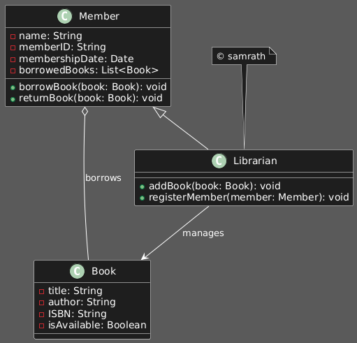
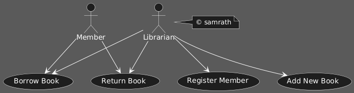
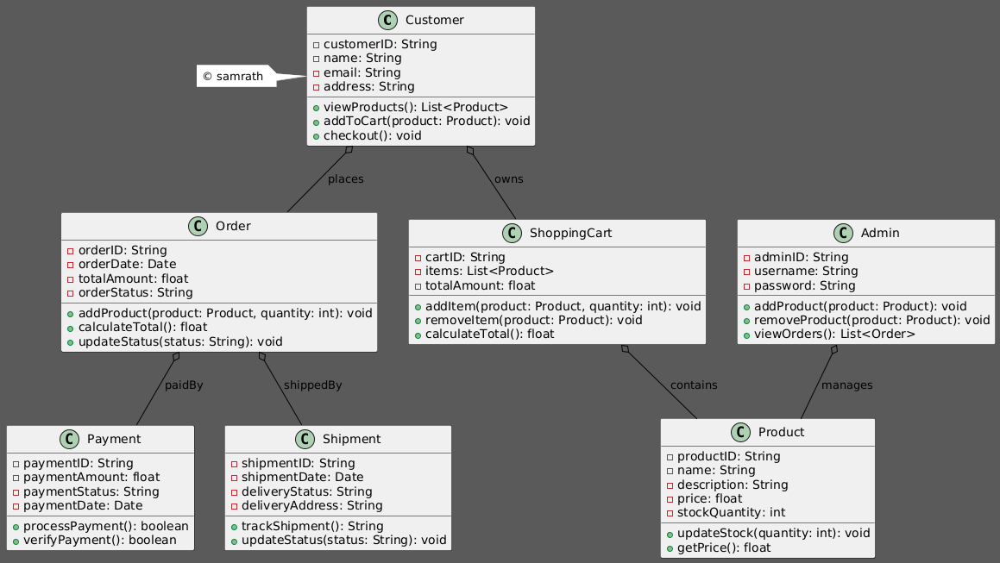
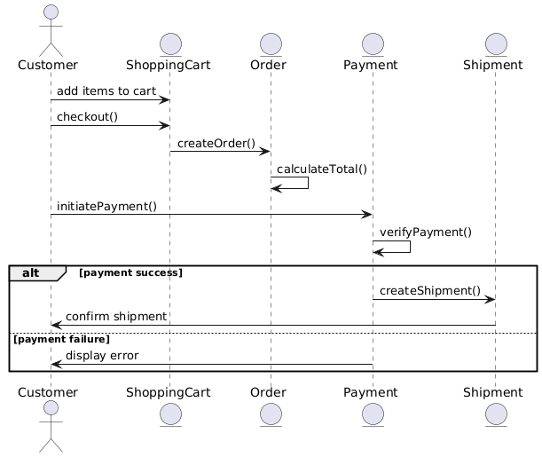
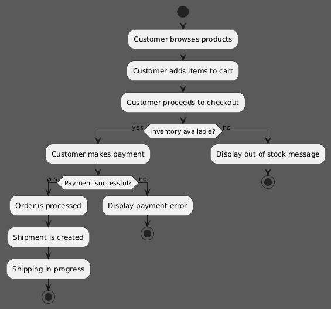

# SDLC-UML Assignment

## Library Management System UML Diagrams

This section contains UML diagrams for the **Library Management System**. The diagrams include:

1. **Class Diagram**: Represents the core entities and their relationships in the library system.
2. **Use Case Diagram**: Illustrates interactions between the actors (Member, Librarian) and the system's use cases.

### Library Class Diagram:
- **Entities**:
  - **Book**: Represents a book in the library. It has key attributes like `title`, `author`, `ISBN`, and `isAvailable`. These attributes help identify a book and track its availability in the library system.
  - **Member**: Represents a library member. Key attributes include `name`, `memberID`, `membershipDate`, and `borrowedBooks`. The `Member` class defines the behavior of members, including methods like `borrowBook` and `returnBook`, which allow them to interact with the `Book` class.
  - **Librarian**: A specialized type of `Member` that can perform additional actions. The `Librarian` class extends the `Member` class and introduces the ability to `addBook` to the library and `registerMember` to add new members to the system. The librarian is responsible for managing the books and ensuring the library’s operations run smoothly.
  
- **Key Relationships**:
  - **Member to Book**: A `Member` can borrow multiple `Books`, represented by the relationship `Member o-- Book`. This indicates that one member can have multiple books borrowed at a time, but a book can only be borrowed by one member at any given moment.
  - **Librarian to Book**: A `Librarian` manages the `Books`. This relationship is represented by `Librarian --> Book`, which shows that librarians are responsible for adding new books to the system and overseeing the collection.
  
- **Summary**: 
  The **Class Diagram** provides a structural view of the system. It shows how the key classes (`Book`, `Member`, `Librarian`) interact with each other. This diagram emphasizes the **inheritance** of the `Librarian` class from the `Member` class, which reflects the extended capabilities of librarians compared to regular members. The relationships between the entities ensure that the system can effectively track books, manage library members, and handle borrowing and returning operations.

**Library Class Diagram Image:**

---

### Library Use Case Diagram:
- **Actors**:
  - **Member**: Represents a user of the library who can borrow and return books. Members typically interact with the system by borrowing books and returning them within the library's policies.
  - **Librarian**: A user responsible for managing the overall library. The librarian can perform all the tasks a member can do, but also has extended privileges to add new books, register new members, and manage the library’s collection.

- **Use Cases**:
  - **Borrow Book**: Both members and librarians can borrow books. The `Borrow Book` use case allows them to borrow a book that is available in the system.
  - **Return Book**: Both members and librarians can return books to the library once the borrowing period is over or if a book is no longer needed.
  - **Register Member**: Only the librarian can register new members to the library system, providing them with the ability to borrow and return books.
  - **Add New Book**: Only the librarian can add new books to the library’s collection, ensuring the system stays up to date with available books.

- **Summary**:
  The **Use Case Diagram** visualizes the interactions between the two primary actors in the library system: `Member` and `Librarian`. The diagram provides a clear overview of how the library system supports its users' needs. While **Members** can borrow and return books, **Librarians** hold broader responsibilities, such as adding new books and registering new members. The diagram also highlights the roles each actor plays in the system, reflecting their access level and functions within the library's operations.

**Library Use Case Diagram Image:**

----

## Online Shopping System UML Diagrams

This section contains UML diagrams for the **Online Shopping System**. The diagrams include:

1. **Class Diagram**: Represents the core entities involved in the online shopping system, including customer interactions, product details, order processing, and payment handling.
2. **Sequence Diagram**: Illustrates the sequence of actions in the "Place Order" process, including interactions between customers, shopping carts, orders, payments, and shipments.
3. **Activity Diagram**: Visualizes the entire order fulfillment process, from browsing products to confirming order delivery.

### Online Shopping Class Diagram:
- **Entities**:
  - **Customer**: Represents the customer shopping on the platform, with attributes like `customerID`, `name`, and `email`. Customers can view products, add items to the cart, and proceed to checkout.
  - **Product**: Represents an individual product for sale on the platform. Key attributes include `productID`, `name`, `description`, `price`, and `stockQuantity`. The `Product` class is responsible for managing product details and stock availability.
  - **Order**: Represents an order placed by the customer. It includes `orderID`, `orderDate`, `totalAmount`, and `orderStatus`. The `Order` class allows for tracking and managing orders.
  - **ShoppingCart**: Represents the cart containing the products the customer has chosen to purchase. Attributes include `cartID`, `items`, and `totalAmount`.
  - **Payment**: Handles the processing of customer payments. Attributes include `paymentID`, `paymentAmount`, `paymentStatus`, and `paymentDate`.
  - **Shipment**: Represents the shipment of an order. It includes `shipmentID`, `shipmentDate`, and `deliveryStatus`. The `Shipment` class manages the shipping process.
  - **Admin**: Represents the administrative user who manages the platform, including adding or removing products, and viewing orders.

- **Key Relationships**:
  - **Customer to Order**: A customer places one or more orders.
  - **ShoppingCart to Product**: A shopping cart contains multiple products.
  - **Order to Payment**: Each order is associated with a payment.
  - **Order to Shipment**: Each order is associated with a shipment for delivery.
  - **Admin to Product**: Admin users manage the platform's product inventory.

**Online Shopping Class Diagram Image:**

---

### Online Shopping Sequence Diagram:
- **Objects Involved**:
  - **Customer**: The customer placing the order.
  - **ShoppingCart**: The cart containing the selected products.
  - **Order**: Represents the order placed by the customer.
  - **Payment**: Processes the payment for the order.
  - **Shipment**: Handles the shipment of the order.

- **Process Flow**:
  1. The customer adds items to the cart.
  2. The customer proceeds to checkout and initiates payment.
  3. The system verifies the payment.
  4. If successful, the order is processed and shipment is initiated.
  5. If there is an issue (e.g., insufficient funds), an error message is displayed.

**Online Shopping Sequence Diagram Image:**

---

### Online Shopping Activity Diagram:
- **Process Flow**:
  1. The customer browses products.
  2. The customer adds items to the cart and proceeds to checkout.
  3. The system verifies inventory and handles payment processing.
  4. If payment is successful, the order is processed and shipped.
  5. The system confirms shipment to the customer.

**Online Shopping Activity Diagram Image:**

---
